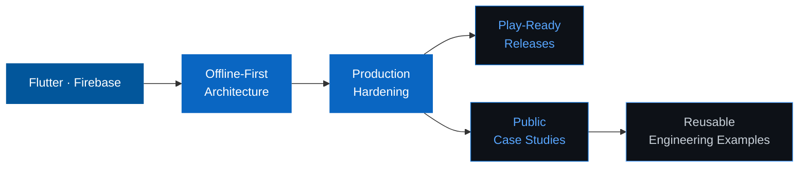

<div align="center">


[](https://git.io/typing-svg)

<br/>

<a href="https://aasimsafeer.vercel.app/">
  
</a>&nbsp;
<a href="https://www.linkedin.com/in/asim-safeer-786710372">
  
</a>&nbsp;
<a href="https://github.com/asimsafeer">
  
</a>&nbsp;


</div>

<br/>

---

<div align="center">

### I build mobile products designed for production — not just demos.

</div>

Reliable auth, offline sync, local caching, background jobs, Firebase monitoring, dashboards, reports, and Android release workflows — everything it takes to ship and keep a real app running.

```yaml
Focus     :  Flutter · Firebase · Offline-First Architecture
Domains   :  Poultry Ops · School Management · Productivity · Mobile AI
Approach  :  Production hardening · Clean UX · Release readiness
```

<br/>

---

## What I Build

<table>
  <tr>
    <td width="50%" valign="top">
      <h3>📱&nbsp; Mobile App Engineering</h3>
      Flutter apps with real user flows, clean state handling, Android platform integrations, local storage, permissions, and app-store-ready builds.
    </td>
    <td width="50%" valign="top">
      <h3>🔥&nbsp; Firebase-Backed Systems</h3>
      Authentication, Firestore, Cloud Storage, App Check, Crashlytics, Remote Config, Performance Monitoring, and security-rule-aware development.
    </td>
  </tr>
  <tr>
    <td width="50%" valign="top">
      <h3>📶&nbsp; Offline-First Reliability</h3>
      Cache-first reads, queued writes, background sync, resilient field workflows, local persistence, and graceful behavior when networks are unreliable.
    </td>
    <td width="50%" valign="top">
      <h3>✨&nbsp; Product Polish</h3>
      Dashboards, reporting, PDF flows, validation, release notes, CI hygiene, documentation, privacy surfaces, and practical production hardening.
    </td>
  </tr>
</table>

<br/>

---

## Featured Projects

<table>
  <tr>
    <td width="50%" valign="top">
      <h3><a href="https://github.com/asimsafeer/Flock-Manager">🐔&nbsp; Flock Manager</a></h3>
      <strong>Production poultry operations app</strong> — Firebase, offline sync, audit logs, reports, push notifications, backup, and full Android release hardening.
      <br/><br/>
      
      
      
    </td>
    <td width="50%" valign="top">
      <h3><a href="https://github.com/asimsafeer/EDU_X">🏫&nbsp; EDU X</a></h3>
      <strong>Offline-first school management platform</strong> — attendance, students, fees, exams, staff, reports, and complete administrative operations.
      <br/><br/>
      
      
      
    </td>
  </tr>
  <tr>
    <td width="50%" valign="top">
      <h3><a href="https://github.com/asimsafeer/NimbusAi">🤖&nbsp; Nimbus AI</a></h3>
      <strong>On-device AI assistant</strong> — model lifecycle management, local chat history, offline readiness, and mobile-first AI UX patterns.
      <br/><br/>
      
      
      
    </td>
    <td width="50%" valign="top">
      <h3><a href="https://github.com/asimsafeer/ScriptFlow">🎬&nbsp; ScriptFlow</a></h3>
      <strong>Creator productivity app</strong> — teleprompter overlay controls, script management, import/export, backup, and Android platform channels.
      <br/><br/>
      
      
      
    </td>
  </tr>
</table>

<br/>

---

## Also Building

<div align="center">

Alongside the public repos above, most of my recent work lives in private and team repos — shipping real apps for real users. A few, briefly:

</div>

| Project | What it is |
|---|---|
| **Lawgistra** | Legal practice management SaaS for Pakistani law firms |
| **legalai-main** | Larger multi-tenant legal-tech platform — Firebase backend, web + mobile clients |
| **digital-khata** | Digital credit ledger (udhaar book) for shopkeepers |
| **kaya** | AI companion app with persistent memory |
| **x_pair** | End-to-end encrypted 1:1 messaging app |
| **shoutly-v2** | Voice-first walkie-talkie messenger |
| **cutoutpro** | Offline AI background remover |
| **construction-calculator-suite** | Offline construction math & material takeoff tool |
| **Health tracker suite** | A family of privacy-first symptom/condition trackers (kidney stone, bloodwork, endo/PCOS, skin flare-ups) |
| **Healthcare-society app** | Client app for a medical professional society |
| **Client livestreaming platform** | VPS-based livestreaming infrastructure for a client |

<br/>

---

## Engineering Stack

<div align="center">

**Mobile**

[](https://skillicons.dev)

**Backend & Data**

[](https://skillicons.dev)

**Tooling & Delivery**

[](https://skillicons.dev)

</div>

<br/>

---

## GitHub Activity

<div align="center">

<picture>
  <source media="(prefers-color-scheme: dark)" srcset="https://raw.githubusercontent.com/asimsafeer/asimsafeer/main/dark.svg">
  <source media="(prefers-color-scheme: light)" srcset="https://raw.githubusercontent.com/asimsafeer/asimsafeer/main/light.svg">
  
</picture>

</div>

<br/>

---

## Current Direction



<br/>

---

## Working Principles

| | |
|---|---|
| **Production-first** | Build for real operational use, not just happy-path demos |
| **Resilient data** | Prefer resilient data flows over fragile UI-only fixes |
| **Release-ready** | Keep release readiness, privacy, validation, and monitoring close to the product |
| **Visible work** | Turn strong work into documentation, case studies, and maintainable public examples |

<br/>

---

<div align="center">

**Open to Flutter/Firebase app work, production hardening, Android release preparation, and practical AI/mobile product builds.**

<br/>

[](https://aasimsafeer.vercel.app/)&nbsp;
[](https://www.linkedin.com/in/asim-safeer-786710372)&nbsp;
[](https://github.com/asimsafeer)

<br/><br/>


</div>
