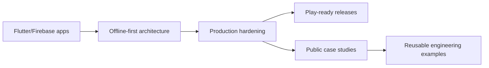

<div align="center">


[](https://git.io/typing-svg)

<p>
  <a href="https://aasimsafeer.vercel.app/"></a>
  <a href="https://www.linkedin.com/in/asim-safeer-786710372"></a>
  <a href="https://github.com/asimsafeer"></a>
  
</p>

</div>

---

## Executive Snapshot

I build mobile products that are designed for production, not just demos: reliable auth, offline sync, local caching, background jobs, Firebase monitoring, dashboards, reports, and Android release workflows.

```text
Primary focus  : Flutter, Firebase, offline-first app architecture
Strong domains : Poultry operations, school management, productivity tools, mobile AI
Delivery style : Production hardening, clean UX, practical documentation, release readiness
```

## What I Bring To A Product

<table>
  <tr>
    <td width="50%">
      <h3>Mobile App Engineering</h3>
      <p>Flutter apps with real user flows, clean state handling, Android platform integrations, local storage, permissions, and app-store-ready builds.</p>
    </td>
    <td width="50%">
      <h3>Firebase-Backed Systems</h3>
      <p>Authentication, Firestore, Cloud Storage, App Check, Crashlytics, Remote Config, Performance Monitoring, and security-rule-aware development.</p>
    </td>
  </tr>
  <tr>
    <td width="50%">
      <h3>Offline-First Reliability</h3>
      <p>Cache-first reads, queued writes, background sync, resilient field workflows, local persistence, and graceful behavior when networks are unreliable.</p>
    </td>
    <td width="50%">
      <h3>Product Polish</h3>
      <p>Dashboards, reporting, PDF flows, validation, release notes, CI hygiene, documentation, privacy surfaces, and practical production hardening.</p>
    </td>
  </tr>
</table>

## Showcase Projects

<table>
  <tr>
    <td width="50%">
      <a href="https://github.com/asimsafeer/Flock-Manager">
        
      </a>
      <p><strong>Production poultry operations app</strong> with Firebase, offline sync, audit logs, reports, notifications, backup, and Android release hardening.</p>
    </td>
    <td width="50%">
      <a href="https://github.com/asimsafeer/EDU_X">
        
      </a>
      <p><strong>Offline-first school management platform</strong> for attendance, students, fees, exams, staff, reports, and operational administration.</p>
    </td>
  </tr>
  <tr>
    <td width="50%">
      <a href="https://github.com/asimsafeer/NimbusAi">
        
      </a>
      <p><strong>On-device AI assistant</strong> with model lifecycle management, local chat history, offline readiness, and mobile-first AI UX.</p>
    </td>
    <td width="50%">
      <a href="https://github.com/asimsafeer/ScriptFlow">
        
      </a>
      <p><strong>Creator productivity app</strong> with teleprompter overlay controls, script management, import/export, backup, and Android platform channels.</p>
    </td>
  </tr>
</table>

## Engineering Stack

<div align="center">

### Mobile


### Backend And Data


### AI, Automation, And Delivery


</div>

## GitHub Analytics

<div align="center">


<br />


<br />


</div>

## Current Direction



## Working Principles

- Build for real operational use, not just happy-path demos.
- Prefer resilient data flows over fragile UI-only fixes.
- Keep release readiness, privacy, validation, and monitoring close to the product.
- Turn strong work into visible documentation, case studies, and maintainable public examples.

## Connect

<div align="center">

I am open to Flutter/Firebase app work, production hardening, Android release preparation, and practical AI/mobile product builds.

[](https://aasimsafeer.vercel.app/)
[](https://www.linkedin.com/in/asim-safeer-786710372)
[](https://github.com/asimsafeer)

</div>


